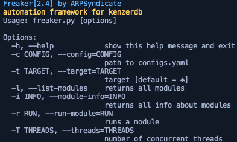

# Freaker | Automation Framework for KenzerDB

## Screenshots

## Instructions for running

1. Install requirements using `pip3 install -I -r requirements.txt`. 
2. FreakerDB can be cloned using `git clone http://github.com/ARPSyndicate/freakerdb`. 
3. Add all the configurations in `configs.yaml` 
4. Run `python3 freaker.py`. 

**COMPATIBILITY TESTED ON ARCHLINUX(x64) & DEBIAN(x64) ONLY** 
**RIGGED WITH LOGIC ISSUES** 
**FEEL FREE TO SUBMIT PULL REQUESTS**
